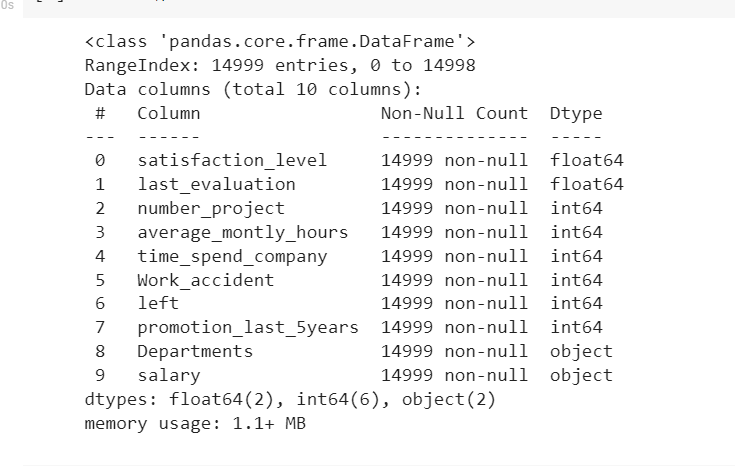
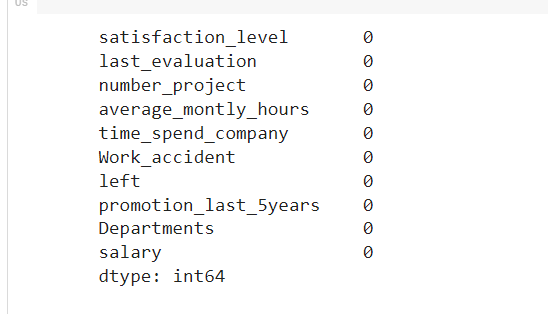

# Implementation-of-Decision-Tree-Classifier-Model-for-Predicting-Employee-Churn

## AIM:
To write a program to implement the Decision Tree Classifier Model for Predicting Employee Churn.

## Equipments Required:
1. Hardware – PCs
2. Anaconda – Python 3.7 Installation / Moodle-Code Runner

## Algorithm
1. Import the required libraries.
2. Upload and read the dataset.
3. Check for any null values using the isnull() function.
4. From sklearn.tree import DecisionTreeClassifier and use criterion as entropy.
5. Find the accuracy of the model and predict the required values by importing the 
6. required module from sklearn.
## Program:
```
/*
Program to implement the Decision Tree Classifier Model for Predicting Employee Churn.
Developed by: JEEVA ABISHAKE
RegisterNumber:  212221240018
*/
import pandas as pd
d=pd.read_csv("/content/Employee.csv")
d.head()
d.info()
d.isnull().sum()
d["left"].value_counts()
from sklearn.preprocessing import LabelEncoder
l=LabelEncoder()
d["salary"]=l.fit_transform(d["salary"])
d.head()
x=d[["satisfaction_level","last_evaluation","number_project","average_montly_hours","time_spend_company","Work_accident","promotion_last_5years","salary"]]
x.head()
y=d["left"]
from sklearn.model_selection import train_test_split
x_train,x_test,y_train,y_test=train_test_split(x,y,test_size=0.2,random_state=100)
from sklearn.tree import DecisionTreeClassifier
dt=DecisionTreeClassifier(criterion="entropy")
dt.fit(x_train,y_train)
y_pred=dt.predict(x_test)
from sklearn import metrics
acc=metrics.accuracy_score(y_test,y_pred)
acc
dt.predict([[.5,.8,9,260,6,0,1,2]])
```

## Output:
### Data Head:

### Information:

### Null dataset:

### Value_counts():

### Data Head:
.png)
### x.head():
.png)
### Accuracy:


### Data Prediction:


## Result:
Thus the program to implement the  Decision Tree Classifier Model for Predicting Employee Churn is written and verified using python programming.
